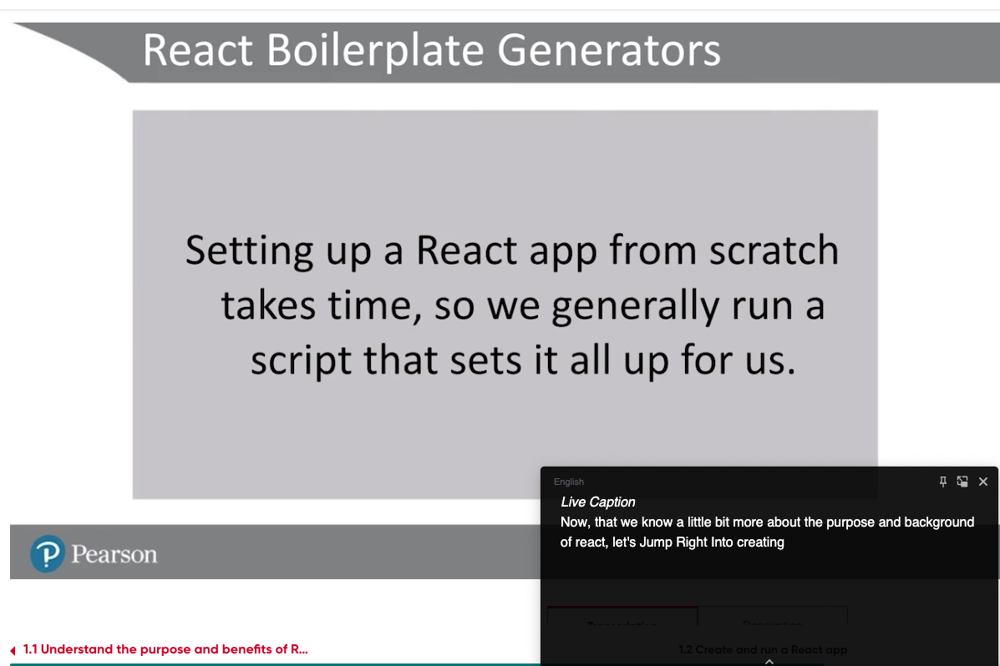
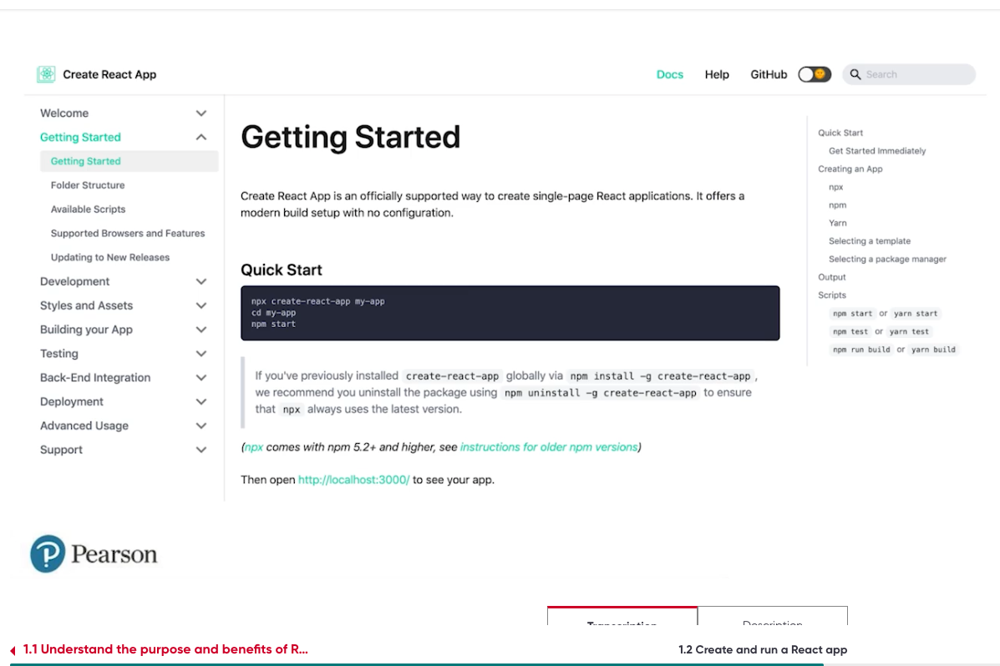
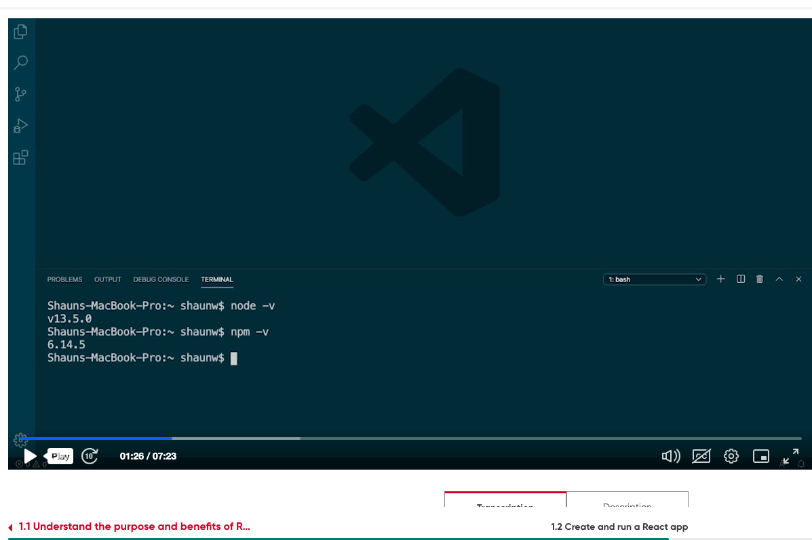

npx create-react-app my-react-app --user-npm
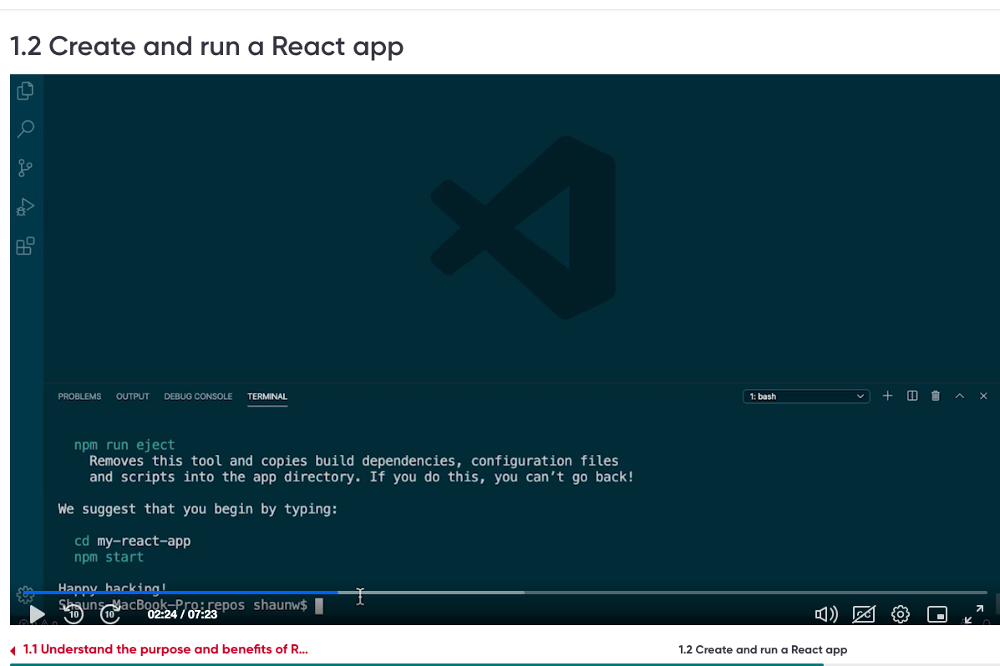
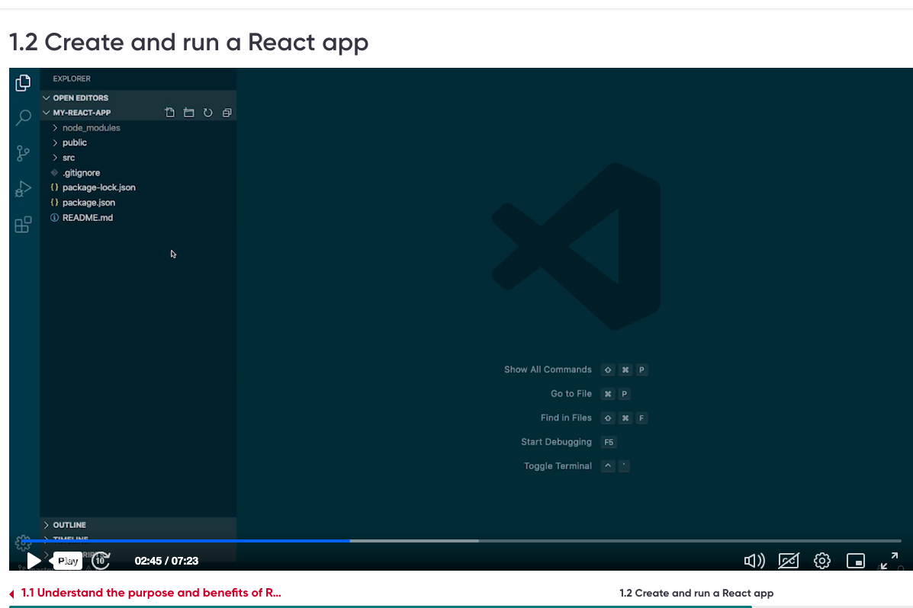
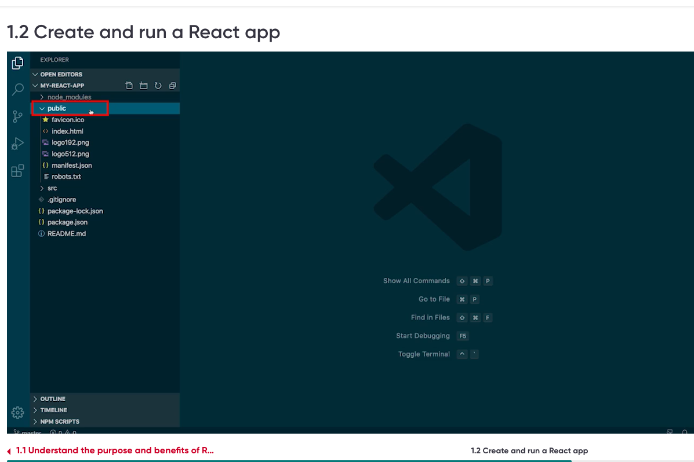
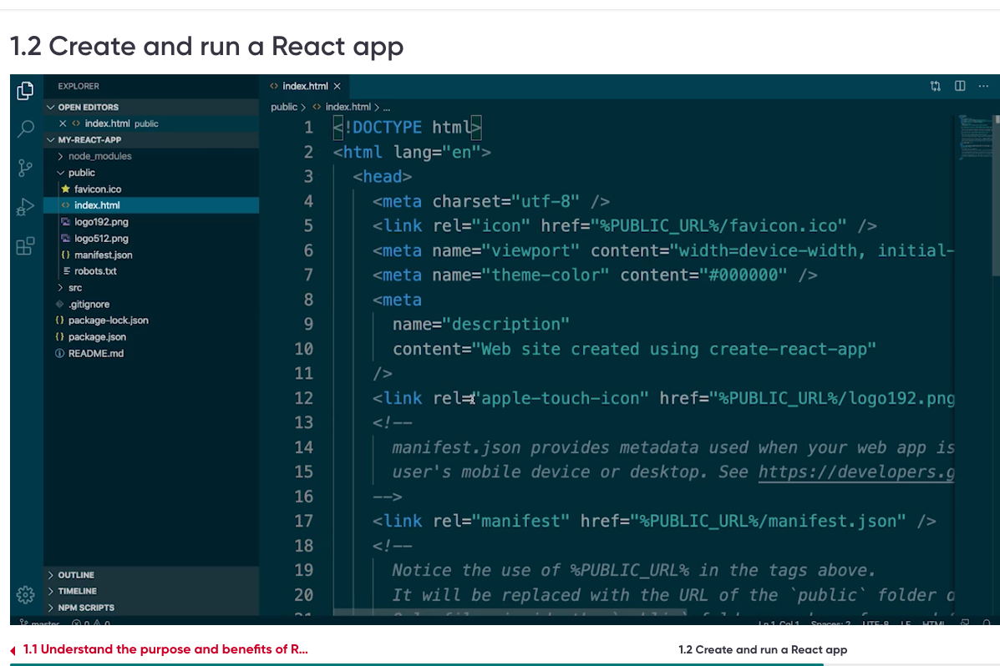
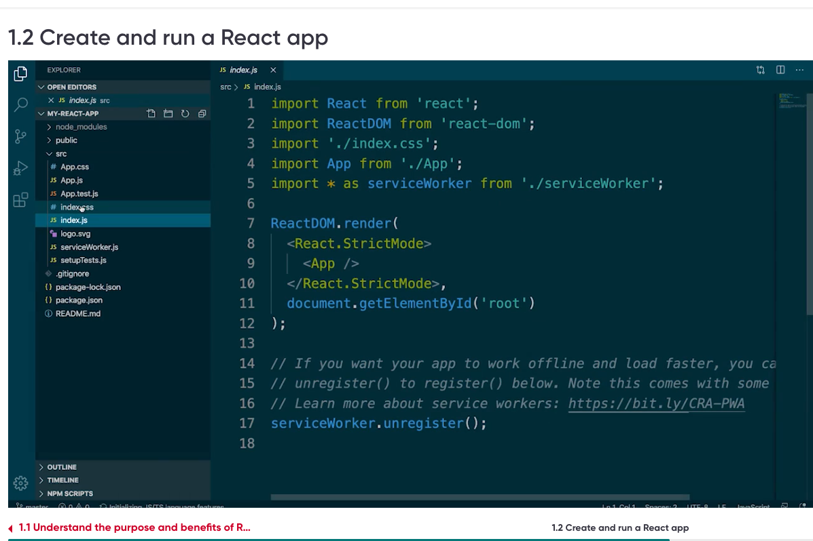
Entry file is index.js file
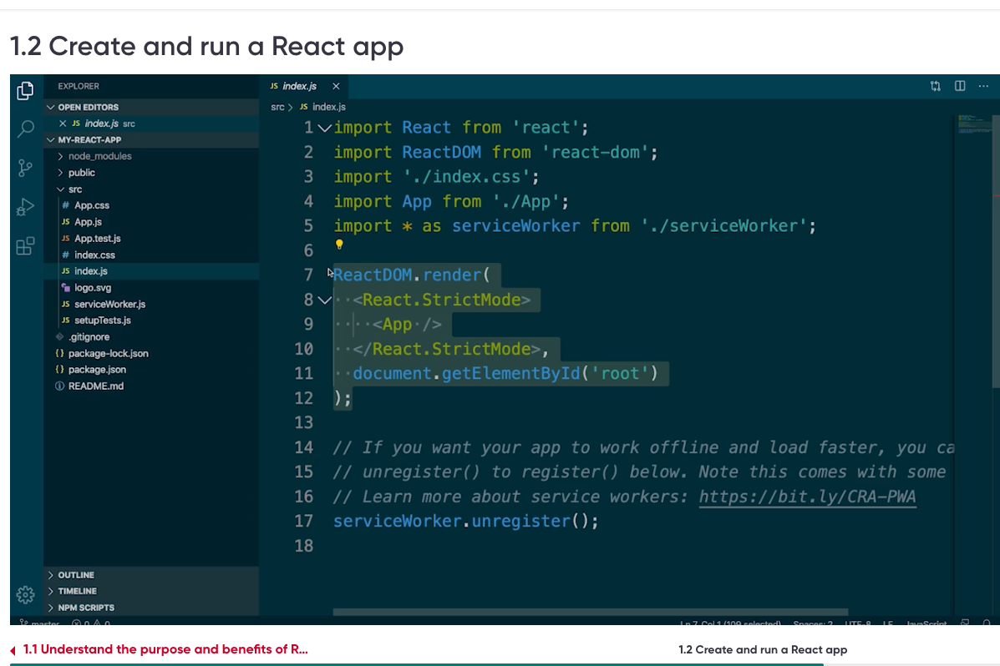
Important part of index.js is app Components

App Component
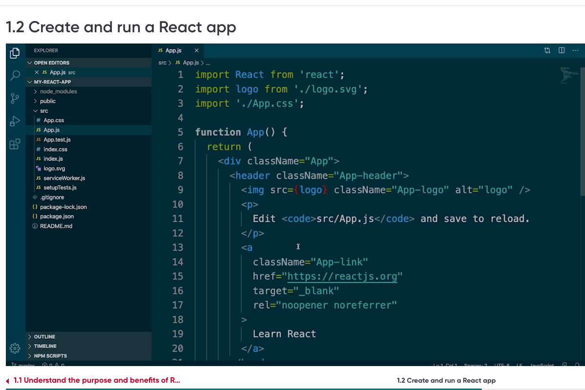
Style for App Component - App.css
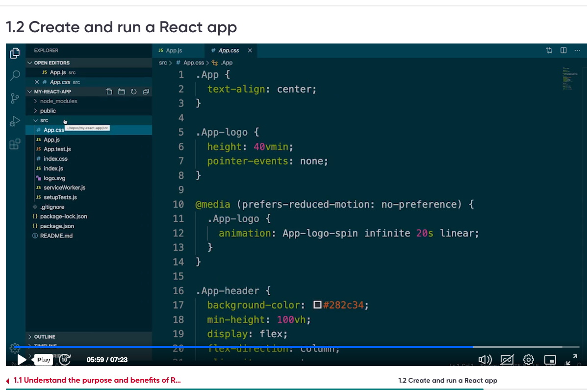
Testing React App
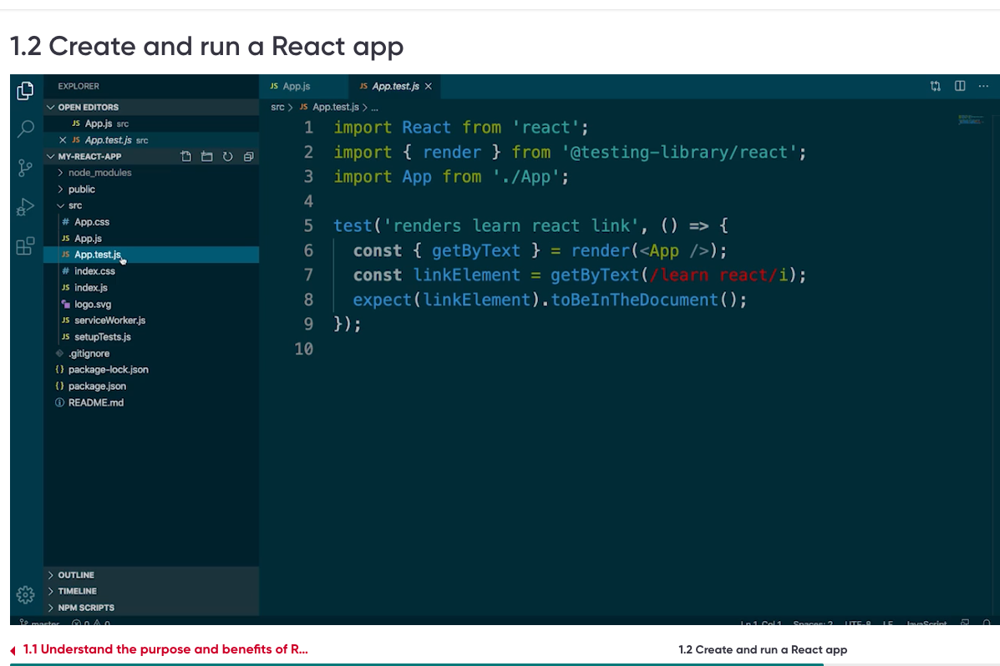
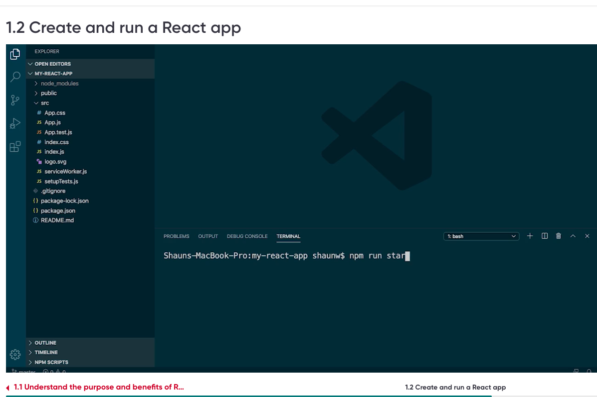
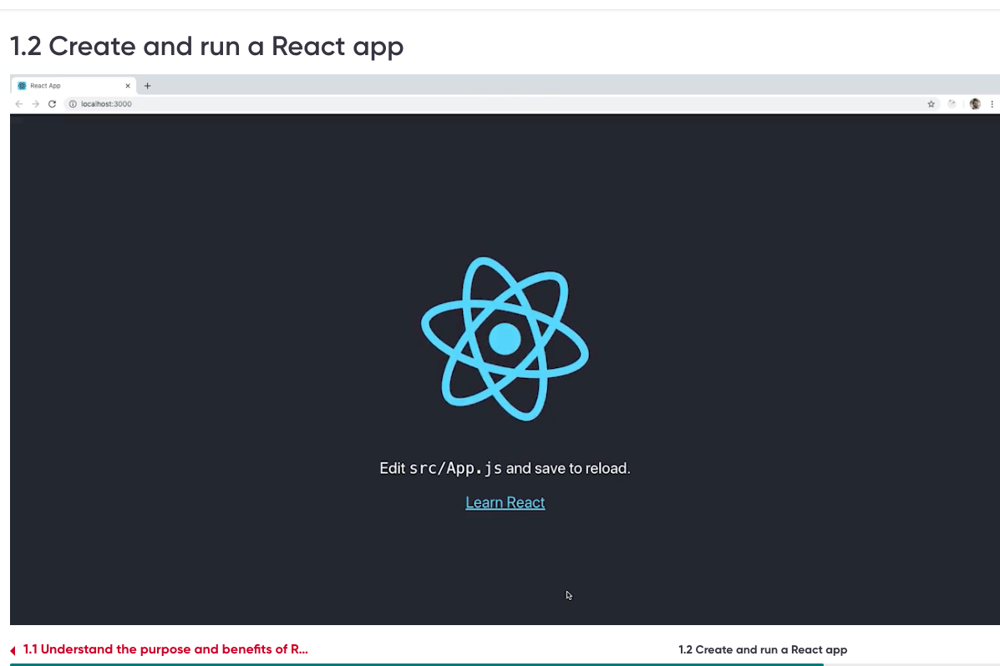
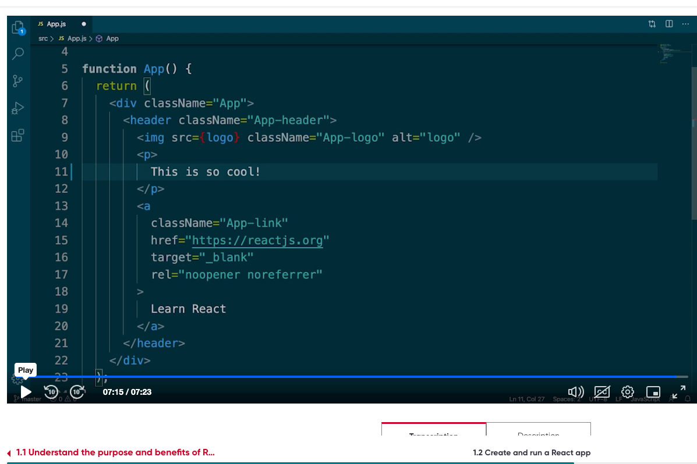
