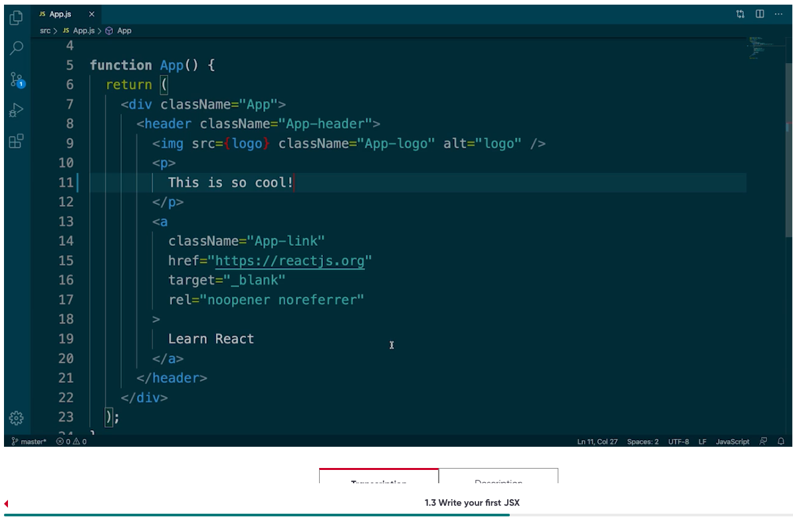
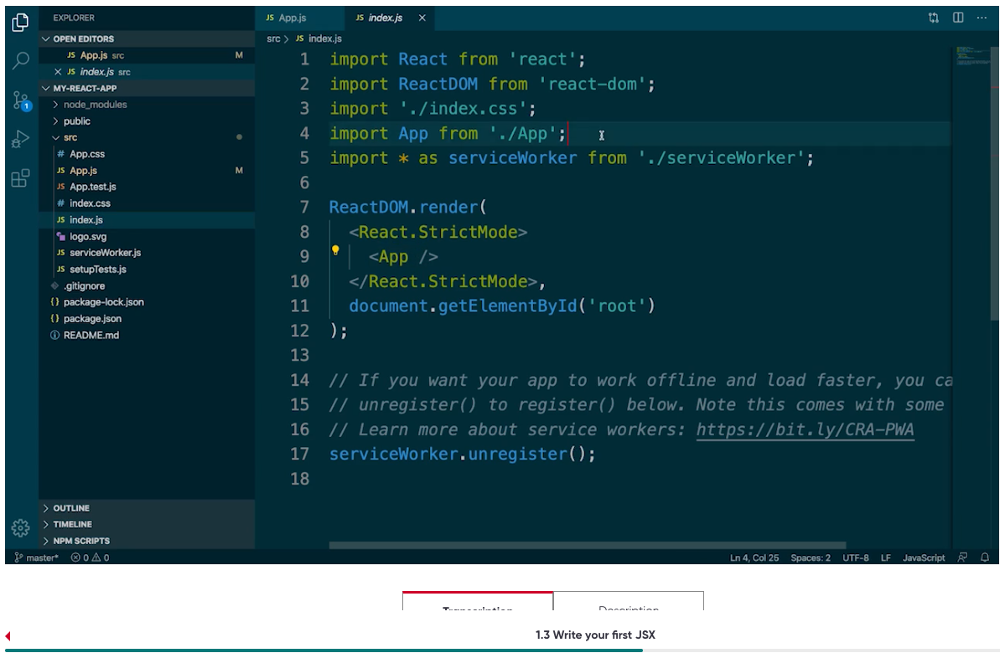
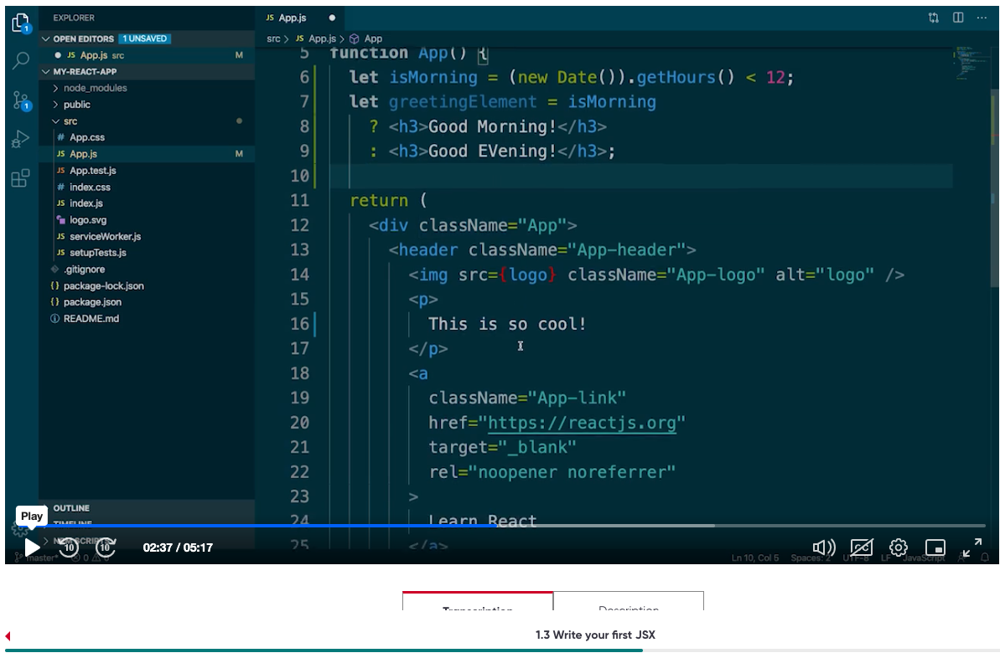
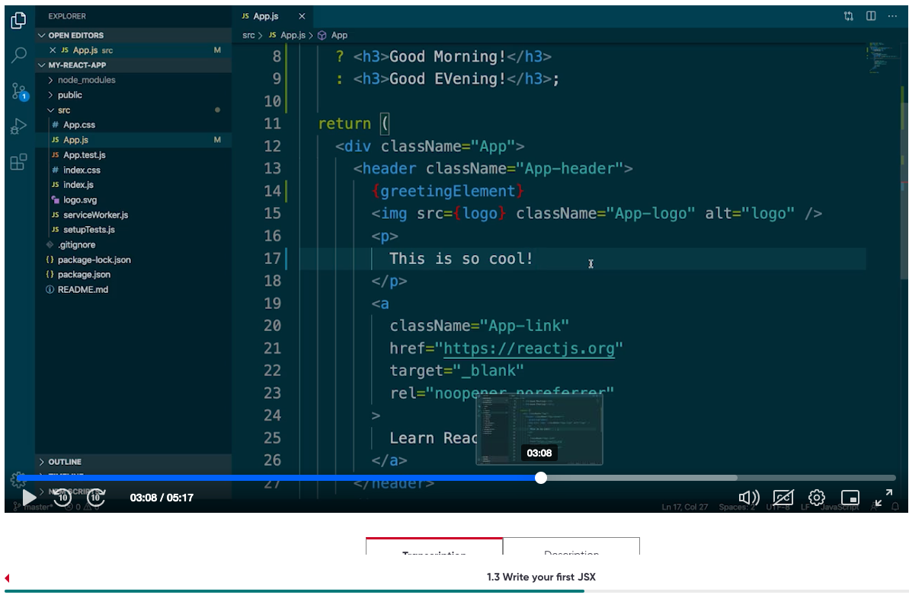
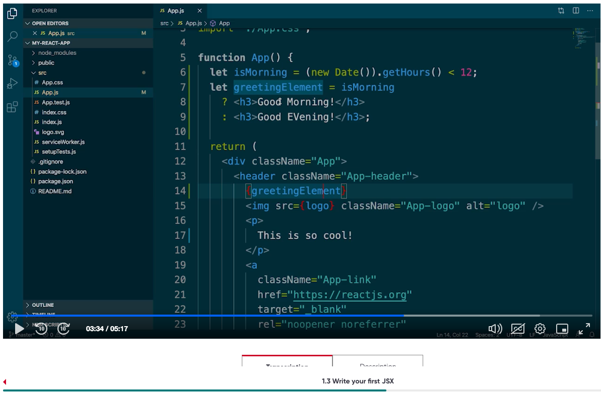
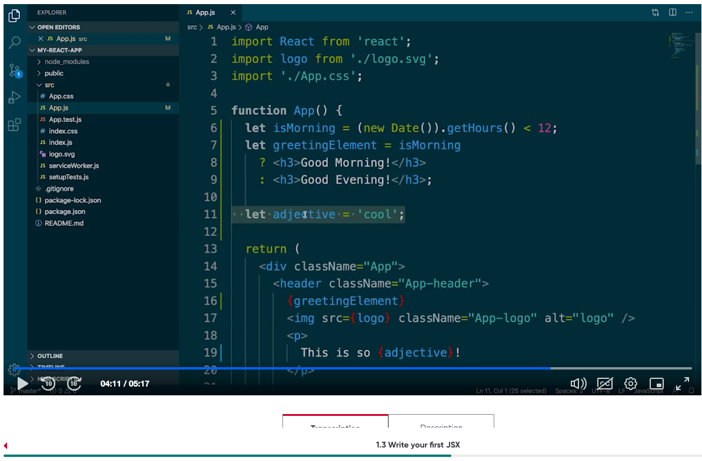
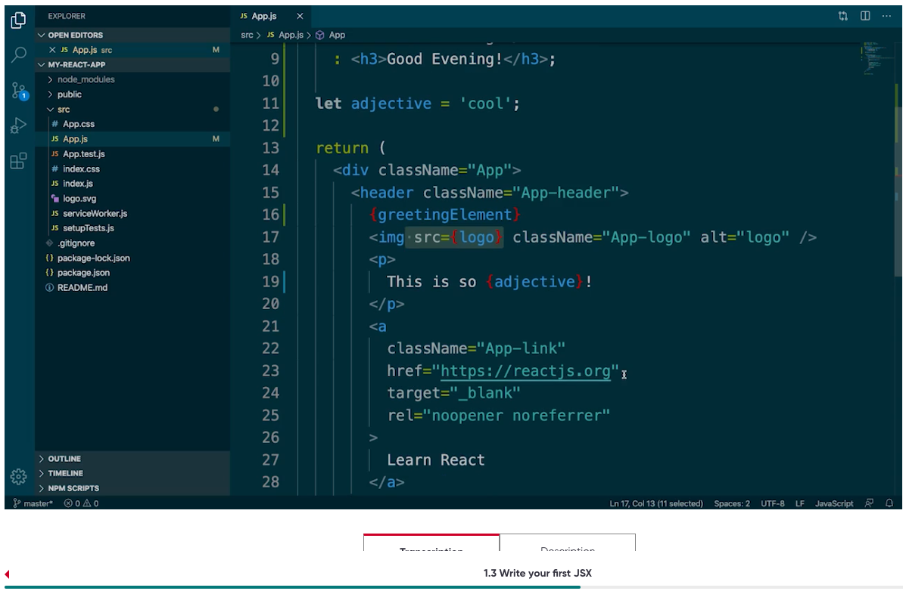
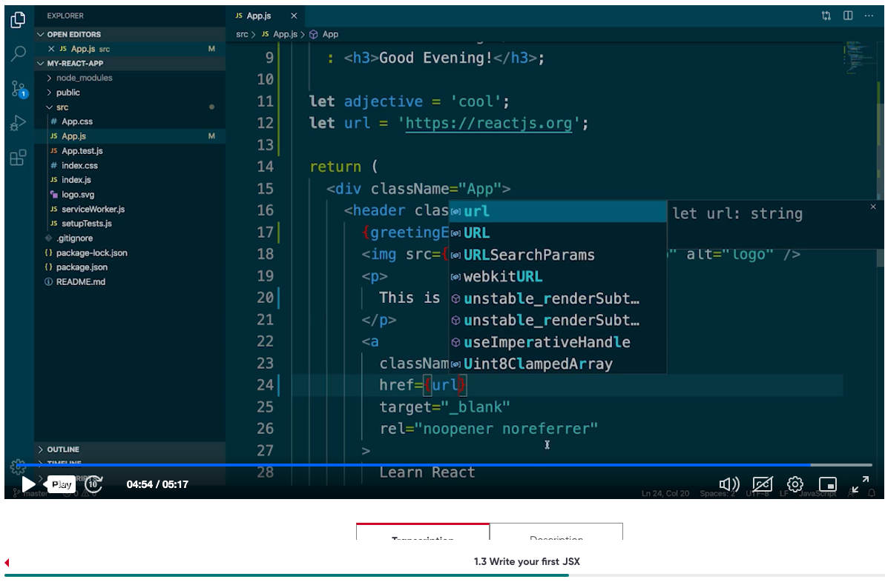

Importing App Component in Index.js


Creating todo list component

<TodoList/>

Greeting the user based on the time
`` 
let isMorning = (new Date()).getHours()< 12;
let greetingElement = isMorning ? <h3> Good Morning! </h3> : <h3> Good Evening! 
```



insert the variable enclosing with curly braces
{greetingElement}


Showcasing {greetingElement} along with the code



Creating a variable adjective = 'cool' 
and inserting below



showing url as link



