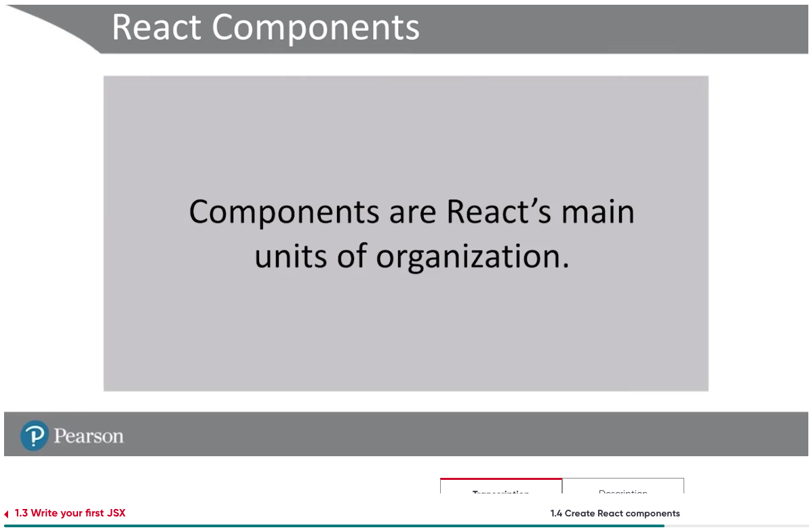
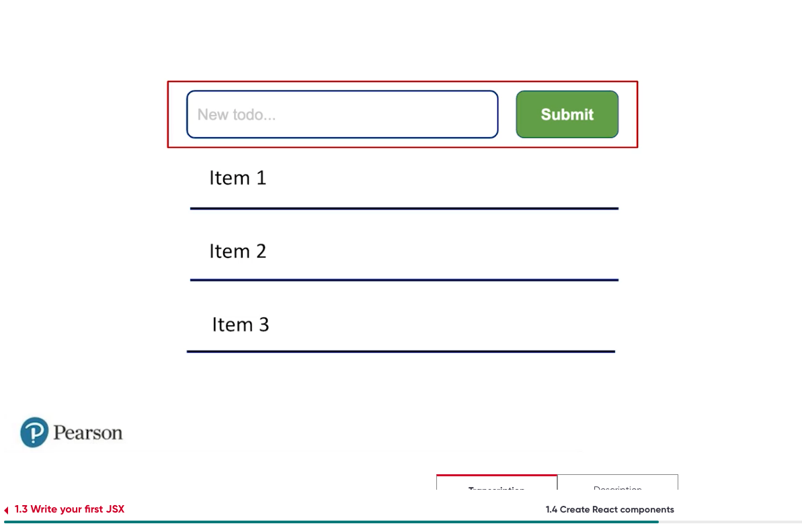
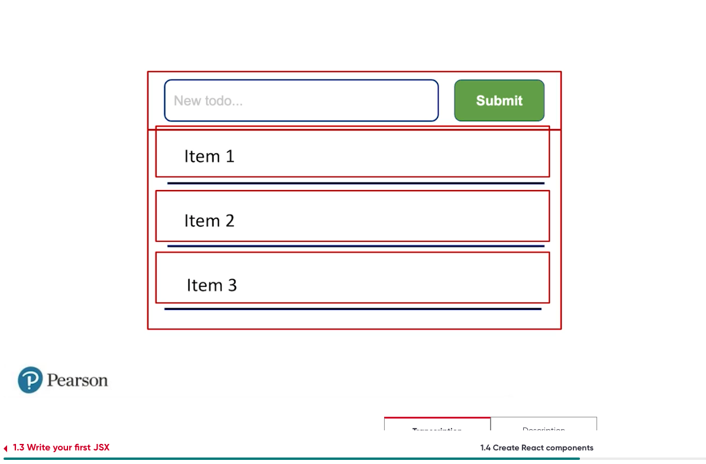
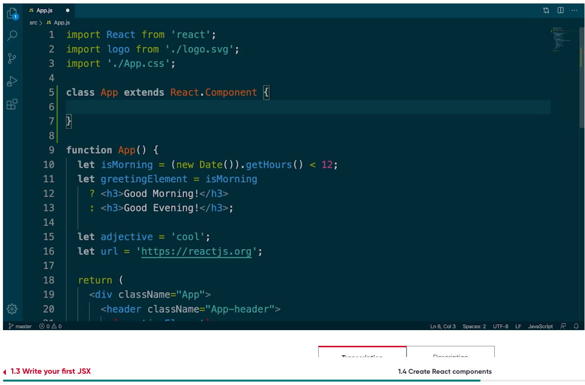
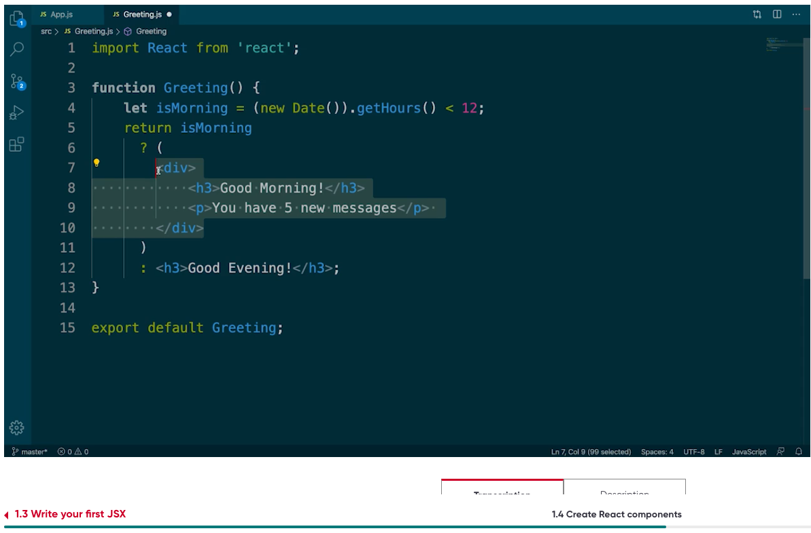
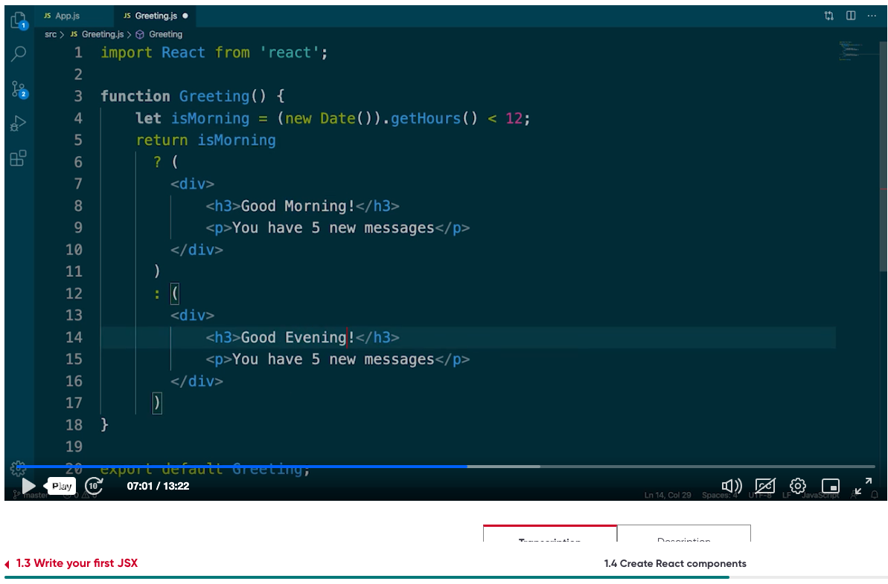

1.4 Creating React Components







Lastest way is functional components sysntacts


```
let isMorning = (new Date()).getHours() < 12;
return is Morning 
?
(
<div>
  <h3>Good Morning! </h3>
  <p>You have 5 new messages </p>
</div>

)
:
(
<div>
  <h3>Good Evening! </h3>
  <p>You have 5 new messages </p>
</div>
)
```

